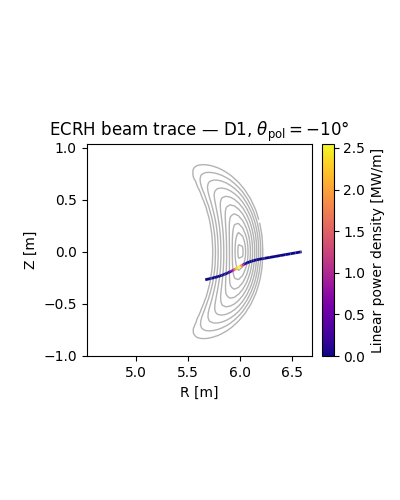
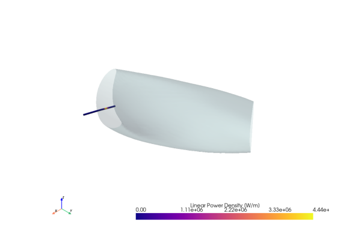

# Raytrax

**An ECRH ray tracer for fusion plasmas, built on JAX.**

[](https://github.com/proximafusion/raytrax/actions/workflows/test.yml)
[](https://opensource.org/licenses/MIT)
[](https://www.python.org/)
[](https://proximafusion.github.io/raytrax/)

Raytrax simulates Electron Cyclotron Resonance Heating (ECRH) of magnetic confinement fusion plasmas. Powered by [JAX](https://docs.jax.dev), it features JIT-compiled ray tracing and automatic differentiation — making it well-suited for gradient-based beam optimization in fusion plant design.

> **Note:** Raytrax is in early development. Expect API changes and incomplete validation.

## Usage

Load a magnetic equilibrium, define plasma profiles, and trace a beam:

```python
import jax.numpy as jnp
import raytrax
import vmecpp

vmec_wout = vmecpp.VmecWOut.from_wout_file("w7x.nc")
mag_conf = raytrax.MagneticConfiguration.from_vmec_wout(vmec_wout)

rho = jnp.linspace(0, 1, 200)
profiles = raytrax.RadialProfiles(
    rho=rho,
    electron_density=2.0 * (1 - rho**2),
    electron_temperature=3.0 * (1 - rho**2),
)
beam = raytrax.Beam(
    position=jnp.array([6.6, 0.0, 0.0]),
    direction=jnp.array([-0.985, 0.0, -0.174]),
    frequency=140e9,
    mode="O",
    power=1e6,
)

result = raytrax.trace(mag_conf, profiles, beam)

print(f"Optical depth τ     = {result.optical_depth:.3f}")
print(f"Absorbed fraction   = {result.absorbed_power_fraction:.1%}")
print(f"Deposition at ρ     = {result.deposition_rho_mean:.2f} ± {result.deposition_rho_std:.2f}")
```

## Visualizations

### Beam trace on a poloidal cross-section



### 3D visualization

Raytrax can render flux surfaces and beam trajectories in 3D using [PyVista](https://pyvista.org):

```python
import pyvista as pv
from raytrax.plot.plot3d import plot_flux_surface_3d, plot_beam_profile_3d

plotter = pv.Plotter()
plot_flux_surface_3d(mag_conf, rho_value=1.0, plotter=plotter, opacity=0.25)
plot_beam_profile_3d(result.beam_profile, plotter=plotter, tube_radius=0.02)
plotter.export_html("scene.html")  # interactive standalone HTML
```



> Try out a **[live interactive version](https://proximafusion.github.io/raytrax/3d-visualisation/)** in the docs.

## Jupyter Notebooks

Quick-start notebooks are in the [`notebooks/`](notebooks/) directory.

## Installation

```bash
python -m pip install raytrax
```

See the [documentation](https://proximafusion.github.io/raytrax/) for a full getting-started guide, theory background, and API reference.

## Acknowledgements

The development of Raytrax is a collaboration between [Proxima Fusion](https://www.proximafusion.com) and the [Munich University of Applied Sciences (HM)](https://www.hm.edu) and was partially supported by the German Federal Ministry of Research, Technology and Space (BMFTR) under grant FPP-MC (13F1001B).

<div align="center">
  
  &nbsp;&nbsp;&nbsp;&nbsp;
  
  &nbsp;&nbsp;&nbsp;&nbsp;
  
</div>

## License

Raytrax is released under the MIT License. See [LICENSE.md](LICENSE.md) for details.
